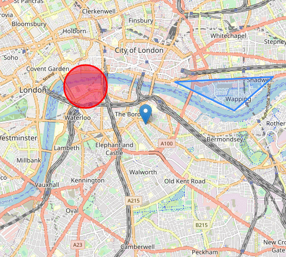
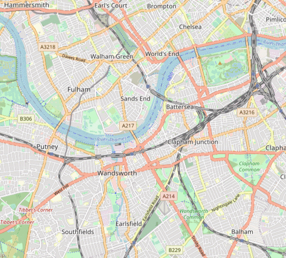
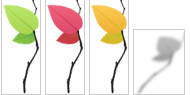
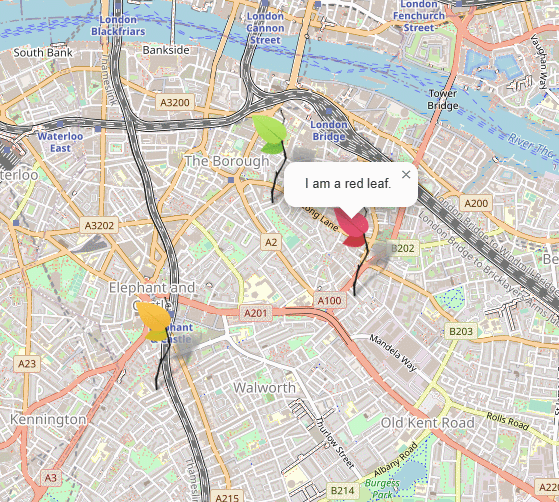
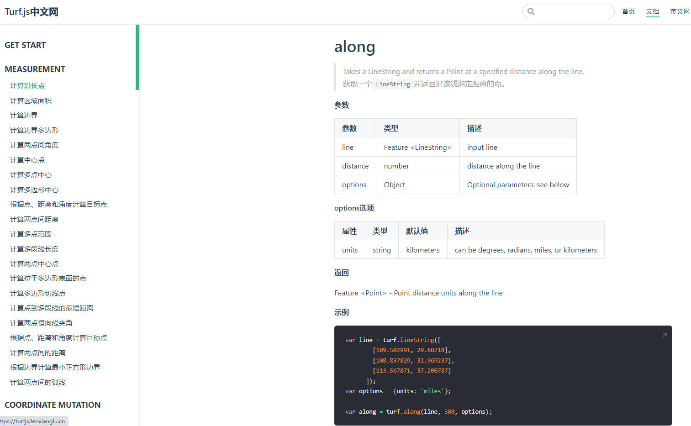
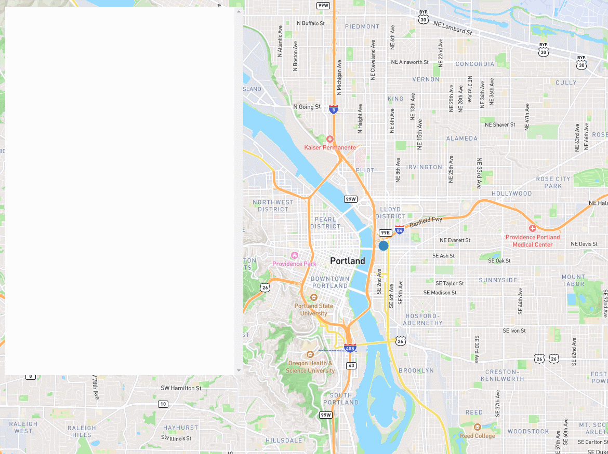

# Vue 3 + Vite + Leaflet
## **一、leafLet 操作指南**
1、下载leaflet源码，<a herf="https://leafletjs.cn/">leaflet官网</a>即可下载到.
下载好的文件组织结构如图(红色框住的是需要引入的，css样式须在js之前引入)

2、复制粘贴至自己新建的文件夹、然后在HTML中引入
```javascript
<link rel="stylesheet" href="./src/plugins/leaflet/leaflet.css" />
<script src="./src/plugins/leaflet/leaflet.js"></script>
```
### 1、用Mapbox Streets 瓦片（Tile）底图创建一张伦敦市中心的地图
```javascript
let map = L.map('map').setView([51.505, -0.09], 13);
L.tileLayer('https://tile.openstreetmap.org/{z}/{x}/{y}.png', {
    maxZoom: 18,
    attribution: '© OpenStreetMap'
}).addTo(map);
```
### 2、标记、圆和多边形和popups  
 
  openPopup 方法（仅适用于标记）立即打开附加的弹出窗口。
```javascript
let marker = L.marker([51.5, -0.09]).addTo(map);
let circle = L.circle([51.508, -0.11], {
    color: 'red',
    fillColor: '#f03',
    fillOpacity: 0.5,
    radius: 500
}).addTo(map);
var polygon = L.polygon([
    [51.509, -0.08],
    [51.503, -0.06],
    [51.51, -0.047]
]).addTo(map);
marker.bindPopup("<b>Hello world!</b><br>I am a popup.").openPopup();
circle.bindPopup("I am a circle.");
polygon.bindPopup("I am a polygon.");
// 您还可以将弹出窗口用作图层（当您需要的不仅仅是将弹出窗口附加到对象时）
let popup = L.popup()
    .setLatLng([51.513, -0.09])
    .setContent("I am a standalone popup.")
    .openOn(map);
```
### 3、处理事件

```javascript
function onMapClick(e) {
    alert("You clicked the map at " + e.latlng);
}
map.on('click', onMapClick);
```
### 4、带有自定义图标的标记


- 创建标记 (图标数量少时)
```javascript
let greenIcon = L.icon({
    iconUrl: './src/assets/leaf-green.png',
    shadowUrl: './src/assets/leaf-shadow.png',

    iconSize:     [38, 95], // size of the icon
    shadowSize:   [50, 64], // size of the shadow
    iconAnchor:   [22, 94], // point of the icon which will correspond to marker's location
    shadowAnchor: [4, 62],  // the same for the shadow
    popupAnchor:  [-3, -76] // point from which the popup should open relative to the iconAnchor
});
L.marker([51.5, -0.09], {icon: greenIcon}).addTo(map);
```
- 定义我们自己的图标类
继承于 L.Icon 在 Leaflet 中
```javascript
let LeafIcon = L.Icon.extend({
    options: {
        shadowUrl: './src/assets/leaf-shadow.png',
        iconSize:     [38, 95],
        shadowSize:   [50, 64],
        iconAnchor:   [22, 94],
        shadowAnchor: [4, 62],
        popupAnchor:  [-3, -76]
    }
});
// 创建所有的带有三个叶子的图标
let greenIcon = new LeafIcon({iconUrl: './src/assets/leaf-green.png'}),
    redIcon = new LeafIcon({iconUrl: './src/assets/leaf-red.png'}),
    orangeIcon = new LeafIcon({iconUrl: './src/assets/leaf-orange.png'});
// 在地图上放一些带有这些图标的标记
L.marker([51.5, -0.09], {icon: greenIcon}).addTo(map).bindPopup("I am a green leaf.");
L.marker([51.495, -0.083], {icon: redIcon}).addTo(map).bindPopup("I am a red leaf.");
L.marker([51.49, -0.1], {icon: orangeIcon}).addTo(map).bindPopup("I am an orange leaf.");
```
你可能已经注意到，我们使用 new 关键字来创建 LeafIcon 实例。那么为什么所有的 Leaflet 类在创建时都没有使用它呢？答案很简单：真正的Leaflet类是用大写字母命名的(例如 L.Icon )，它们也需要用 new 来创建，但也有一些小写名字的快捷方式( L.icon )，是为了方便而创建的，比如这样:
```javascript
L.icon = function (options) {
    return new L.Icon(options);
};
```
### 5、geojson数据加载
如geojsonMap组件内容所示

## **二、turf 操作指南**
<a href = "https://turfjs.fenxianglu.cn/">Turf.js中文网</a>

开箱即用，非常简单,按照官网上的例子，可以直接在控制台检查处理结果
1、下载安装
```javascript
npm install @turf/turf
```
2、引入使用即可
```javascript
import * as turf from '@turf/turf'
```
## **三、mapbox 操作指南**
**不可忽略的缺点**：每个地图加载包括无限制的矢量、栅格和地形图块 API 请求。每月前 50000 次地图加载是免费的，然后每 1000 次地图加载 5 美元起，每月超过 100000、200000 和 1000000 次地图加载时可享受增量折扣。

1、引入
> 1>直接CDN引入
 ```javascript
<script src="https://api.tiles.mapbox.com/mapbox-gl-js/v2.14.1/mapbox-gl.js"></script>
<link href="https://api.tiles.mapbox.com/mapbox-gl-js/v2.14.1/mapbox-gl.css" rel="stylesheet"/>
 ```
> 2>使用插件引入
 ```javascript
npm install --save mapbox-gl
// 安装完成后引入
import mapboxgl from 'mapbox-gl'
 ```
 2、创建地图和弹出窗口
 
  ```javascript
const map = new mapboxgl.Map({
    container: 'map', //id
    style: 'mapbox://styles/examples/clg45vm7400c501pfubolb0xz', 
    preserveDrawingBuffer: true,//允许地图导出为图片,
    center: [-87.661557, 41.893748], 
    zoom: 9 
});
map.on('click', (event) => {
    const features = map.queryRenderedFeatures(event.point, {
        layers: ['chicago-parks']
    });
    console.log(features)
    if (!features.length) {
        console.log("直接返回")
        return;
    }
    const feature = features[0];

    const popup = new mapboxgl.Popup({ offset: [0, -15] })
        .setLngLat(feature.geometry.coordinates)
        .setHTML(
        `<h3>${feature.properties.title}</h3><p>${feature.properties.description}</p>`
        )
        .addTo(map);
});
 ```
3、自定义的标记点

```javascript
const el = document.createElement('div');
el.className = 'marker';
// make a marker for each feature and add to the map
new mapboxgl.Marker(el)
    .setLngLat([-122.414, 37.776])
    .setPopup(
        new mapboxgl.Popup({ offset: 25 }) // add popups
            .setHTML(
                `<h3>Mapbox</h3><p>San Francisco, California</p>`
        )
    ).addTo(map);
```
4、导航路径

```javascript

```